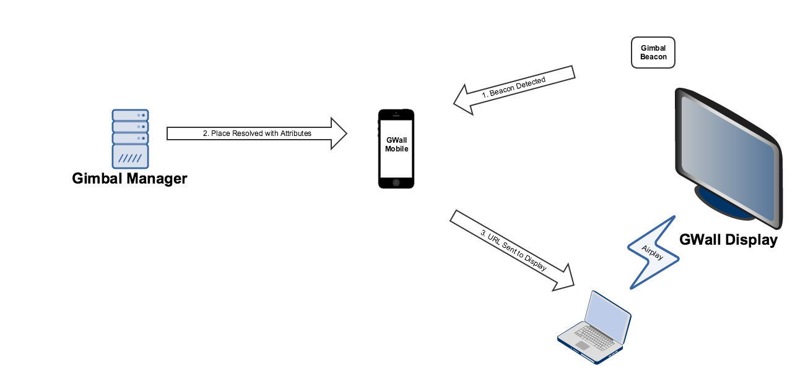

# GWall
Sample iOS reactive display using Gimbal Beacons
## Overview
There are three components to this sample an iOS mobile device (iPhone, iPad, etc), an iOS or OSX display device (iPhone, iPad, Macbook, Mac Mini, etc) and a Gimbal Beacon.

The diagram below shows the callflow between the three components and the Gimbal Manager to drive this reactive display demonstration.



### Mobile Device
The mobile device is an iOS device running this GWall application. The proximity of this device to the Gimbal Beacon will drive what is displayed on the display device.
### Display Device
The display device is either an iOS device or OSX device running either the GWall application (in display mode) or GWall Display (OSX) application. This device simply displays a URL and can be connected to a larger display for demonstration purposes.
### Gimbal Beacon
The Gimbal Beacon is configured with one or two attributes (details below) that drive the content displayed on the display device when the mobile device is proximate to it.
## How do I get set it up?
### Gimbal Manager
* Log into [Gimbal Manager](https://manager.gimbal.com)
* [Create an Application with](https://manager.gimbal.com/apps/new) the bundle ID: **com.gimbal.GWall**
* [Create a Place](https://manager.gimbal.com/places/new) with a Gimbal Beacon and add an attribute key **gwall.url** with value pointing to a URL that you want your display to render
  * You can optionally add a **gwall.default** attribute key with a value pointing to a URL you want to display when you depart this beacon
  * You can optionally define fine tuned RSSI values for your place so the beacon detection will not happen until you are very close to the display
### Mobile Device
* Clone this project
* Run **pod install** to retrieve the Gimbal SDK dependency
```sh
$ pod install
``` 
* Open **GWall.xcworkspace**
```sh
$ open GWall.xcworkspace
```
* Fill your Gimbal API Key for the **com.gimbal.GWall** application you created into the **GWallManager.swift** class
```swift
static let GIMBAL_API_KEY = "YOUR_GIMBAL_API_KEY_HERE"
```
* Run the application on your mobile
### Display Device - iOS
* Follow the above steps and choose the **Display** option in the tab bar when the application launces
### Display Device - OSX
* Clone the companion application **GWall Display**
* Run the applicaiton on your OSX device